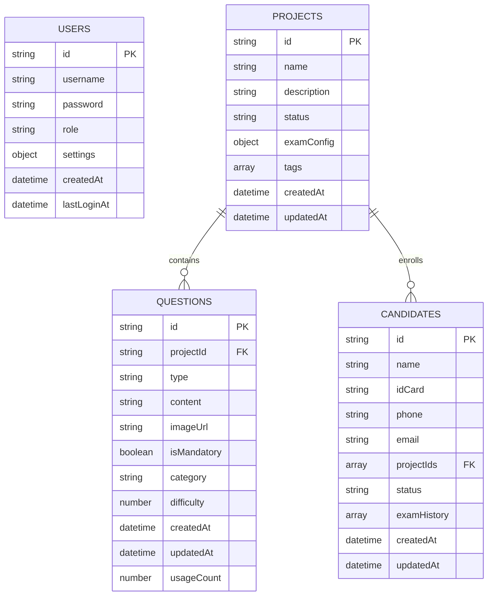

# 数据库架构设计文档

## 概述

本文档详细定义了智能抽题考试系统的本地JSON数据库架构。系统采用四个独立的JSON文件作为数据存储，每个文件负责特定的业务领域，确保数据的组织性、完整性和可维护性。

## 架构

### 数据存储架构

```
data/
├── db/
│   ├── users.json          # 用户数据
│   ├── projects.json       # 项目数据  
│   ├── questions.json      # 题目数据
│   └── candidates.json     # 考生数据
└── images/                 # 题目图片存储
    └── questions/
        ├── {questionId}/
        └── ...
```

### 数据关系图



## 组件和接口

### 1. 用户数据结构 (users.json)

```json
{
  "version": "1.0.0",
  "lastUpdated": "2025-01-21T10:00:00.000Z",
  "data": [
    {
      "id": "usr_admin_01",
      "username": "admin",
      "password": "123123",
      "role": "admin",
      "profile": {
        "name": "系统管理员",
        "email": "admin@example.com",
        "phone": "",
        "avatar": ""
      },
      "settings": {
        "defaultQuestionCount": 10,
        "theme": "light",
        "language": "zh-CN",
        "autoSave": true,
        "notifications": {
          "email": true,
          "system": true
        }
      },
      "permissions": [
        "user:manage",
        "project:manage", 
        "question:manage",
        "candidate:manage",
        "exam:manage",
        "system:config"
      ],
      "status": "active",
      "createdAt": "2025-01-21T10:00:00.000Z",
      "updatedAt": "2025-01-21T10:00:00.000Z",
      "lastLoginAt": null,
      "loginCount": 0,
      "metadata": {
        "createdBy": "system",
        "notes": "默认管理员账户"
      }
    }
  ]
}
```

**字段说明：**
- `id`: 用户唯一标识符，格式：usr_{role}_{序号}
- `username`: 登录用户名，唯一
- `password`: 密码（生产环境应加密）
- `role`: 用户角色 (admin/candidate)
- `profile`: 用户基本信息
- `settings`: 个性化设置
- `permissions`: 权限列表
- `status`: 账户状态 (active/disabled/locked)

### 2. 项目数据结构 (projects.json)

```json
{
  "version": "1.0.0",
  "lastUpdated": "2025-01-21T10:00:00.000Z",
  "data": [
    {
      "id": "proj_001",
      "name": "特种设备安全管理",
      "description": "特种设备安全管理人员考试项目",
      "category": "特种设备",
      "status": "active",
      "examConfig": {
        "totalQuestions": 20,
        "mandatoryQuestions": 10,
        "optionalQuestions": 10,
        "timeLimit": 60,
        "passingScore": 80,
        "allowRetake": true,
        "maxRetakeCount": 3,
        "shuffleQuestions": true,
        "showResults": true
      },
      "tags": ["安全管理", "特种设备", "管理人员"],
      "statistics": {
        "totalQuestions": 0,
        "mandatoryCount": 0,
        "optionalCount": 0,
        "candidateCount": 0,
        "examCount": 0,
        "averageScore": 0
      },
      "createdBy": "usr_admin_01",
      "status": "active",
      "createdAt": "2025-01-21T10:00:00.000Z",
      "updatedAt": "2025-01-21T10:00:00.000Z",
      "metadata": {
        "version": "1.0",
        "notes": "",
        "archived": false
      }
    }
  ]
}
```

**字段说明：**
- `id`: 项目唯一标识符，格式：proj_{序号}
- `examConfig`: 考试配置参数
- `statistics`: 项目统计信息
- `status`: 项目状态 (active/disabled/archived)

### 3. 题目数据结构 (questions.json)

```json
{
  "version": "1.0.0",
  "lastUpdated": "2025-01-21T10:00:00.000Z",
  "data": [
    {
      "id": "que_001",
      "projectId": "proj_001",
      "type": "text",
      "content": "特种设备安全管理的基本原则是什么？",
      "imageUrl": null,
      "imageAlt": "",
      "isMandatory": true,
      "category": "基础知识",
      "difficulty": 2,
      "tags": ["安全管理", "基础"],
      "answer": {
        "type": "descriptive",
        "content": "安全第一、预防为主、综合治理",
        "keywords": ["安全第一", "预防为主", "综合治理"],
        "scoringCriteria": {
          "maxScore": 100,
          "keywordScores": {
            "安全第一": 30,
            "预防为主": 35,
            "综合治理": 35
          }
        }
      },
      "usage": {
        "count": 0,
        "lastUsed": null,
        "averageScore": 0
      },
      "createdBy": "usr_admin_01",
      "status": "active",
      "createdAt": "2025-01-21T10:00:00.000Z",
      "updatedAt": "2025-01-21T10:00:00.000Z",
      "metadata": {
        "source": "manual",
        "notes": "",
        "reviewStatus": "approved"
      }
    },
    {
      "id": "que_002", 
      "projectId": "proj_001",
      "type": "image",
      "content": "请根据图片描述特种设备的安全隐患",
      "imageUrl": "/images/questions/que_002/safety_hazard.jpg",
      "imageAlt": "特种设备安全隐患示意图",
      "isMandatory": false,
      "category": "实践应用",
      "difficulty": 3,
      "tags": ["图片题", "安全隐患", "实践"],
      "answer": {
        "type": "descriptive",
        "content": "设备老化、操作不当、维护不足",
        "keywords": ["设备老化", "操作不当", "维护不足"],
        "scoringCriteria": {
          "maxScore": 100,
          "keywordScores": {
            "设备老化": 40,
            "操作不当": 30,
            "维护不足": 30
          }
        }
      },
      "usage": {
        "count": 0,
        "lastUsed": null,
        "averageScore": 0
      },
      "createdBy": "usr_admin_01",
      "status": "active",
      "createdAt": "2025-01-21T10:00:00.000Z",
      "updatedAt": "2025-01-21T10:00:00.000Z",
      "metadata": {
        "source": "manual",
        "notes": "需要定期更新图片",
        "reviewStatus": "approved"
      }
    }
  ]
}
```

**字段说明：**
- `id`: 题目唯一标识符，格式：que_{序号}
- `type`: 题目类型 (text/image/mixed)
- `difficulty`: 难度等级 (1-5)
- `answer`: 参考答案和评分标准
- `usage`: 使用统计信息

### 4. 考生数据结构 (candidates.json)

```json
{
  "version": "1.0.0",
  "lastUpdated": "2025-01-21T10:00:00.000Z",
  "data": [
    {
      "id": "cand_001",
      "name": "张三",
      "idCard": "110101199001011234",
      "profile": {
        "gender": "male",
        "birthDate": "1990-01-01",
        "phone": "13800138000",
        "email": "zhangsan@example.com",
        "address": "北京市朝阳区",
        "company": "某某公司",
        "position": "安全管理员"
      },
      "projectIds": ["proj_001"],
      "examHistory": [
        {
          "id": "exam_001",
          "projectId": "proj_001",
          "projectName": "特种设备安全管理",
          "questions": [
            {
              "questionId": "que_001",
              "content": "特种设备安全管理的基本原则是什么？",
              "type": "text",
              "answer": "安全第一、预防为主、综合治理",
              "score": 95,
              "maxScore": 100,
              "scoredAt": "2025-01-21T11:30:00.000Z"
            }
          ],
          "totalScore": 95,
          "maxScore": 100,
          "percentage": 95.0,
          "passed": true,
          "startTime": "2025-01-21T11:00:00.000Z",
          "endTime": "2025-01-21T11:45:00.000Z",
          "duration": 45,
          "examiner": "usr_admin_01",
          "notes": "表现优秀",
          "status": "completed"
        }
      ],
      "statistics": {
        "totalExams": 1,
        "passedExams": 1,
        "averageScore": 95.0,
        "bestScore": 95,
        "lastExamDate": "2025-01-21T11:00:00.000Z"
      },
      "status": "active",
      "createdAt": "2025-01-21T10:00:00.000Z",
      "updatedAt": "2025-01-21T12:00:00.000Z",
      "metadata": {
        "source": "manual",
        "notes": "",
        "tags": ["优秀学员"]
      }
    }
  ]
}
```

**字段说明：**
- `id`: 考生唯一标识符，格式：cand_{序号}
- `idCard`: 身份证号，作为业务唯一标识
- `examHistory`: 完整的考试历史记录
- `statistics`: 考试统计信息
- `status`: 考生状态 (active/disabled/graduated)

## 数据模型

### 数据验证规则

```javascript
// 用户数据验证
const userSchema = {
  id: { type: 'string', required: true, pattern: /^usr_\w+_\d+$/ },
  username: { type: 'string', required: true, minLength: 3, maxLength: 50 },
  password: { type: 'string', required: true, minLength: 6 },
  role: { type: 'string', required: true, enum: ['admin', 'candidate'] },
  status: { type: 'string', required: true, enum: ['active', 'disabled', 'locked'] }
}

// 项目数据验证
const projectSchema = {
  id: { type: 'string', required: true, pattern: /^proj_\d+$/ },
  name: { type: 'string', required: true, minLength: 1, maxLength: 100 },
  status: { type: 'string', required: true, enum: ['active', 'disabled', 'archived'] },
  'examConfig.totalQuestions': { type: 'number', required: true, min: 1, max: 200 }
}

// 题目数据验证
const questionSchema = {
  id: { type: 'string', required: true, pattern: /^que_\d+$/ },
  projectId: { type: 'string', required: true, pattern: /^proj_\d+$/ },
  type: { type: 'string', required: true, enum: ['text', 'image', 'mixed'] },
  content: { type: 'string', required: true, minLength: 1 },
  difficulty: { type: 'number', required: true, min: 1, max: 5 }
}

// 考生数据验证
const candidateSchema = {
  id: { type: 'string', required: true, pattern: /^cand_\d+$/ },
  name: { type: 'string', required: true, minLength: 1, maxLength: 50 },
  idCard: { type: 'string', required: true, pattern: /^\d{17}[\dX]$/ },
  status: { type: 'string', required: true, enum: ['active', 'disabled', 'graduated'] }
}
```

## 错误处理

### 数据完整性保护

1. **文件初始化**：系统启动时检查并创建缺失的数据文件
2. **格式验证**：读取数据时验证JSON格式和必填字段
3. **引用完整性**：删除项目时检查关联的题目和考生
4. **备份机制**：重要操作前自动备份数据文件
5. **错误恢复**：数据损坏时从备份恢复或重建默认结构

### 并发控制

1. **文件锁定**：写操作时锁定文件防止并发修改
2. **原子操作**：使用临时文件确保写操作的原子性
3. **版本控制**：记录数据版本防止冲突覆盖

## 测试策略

### 单元测试

1. **数据验证测试**：验证所有字段的格式和约束
2. **CRUD操作测试**：测试增删改查的正确性
3. **边界条件测试**：测试极限值和异常情况
4. **性能测试**：测试大数据量下的读写性能

### 集成测试

1. **数据关联测试**：测试跨文件的数据关联
2. **并发访问测试**：测试多用户同时操作
3. **数据迁移测试**：测试版本升级时的数据兼容性

### 数据完整性测试

1. **引用完整性**：确保外键关联的有效性
2. **数据一致性**：确保统计数据与实际数据一致
3. **备份恢复测试**：验证备份和恢复功能的可靠性